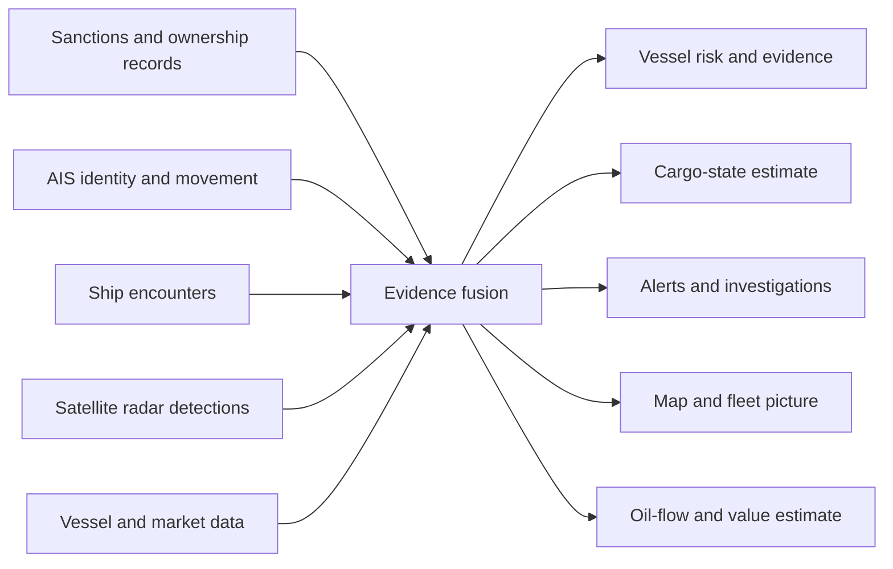

# Ghost Fleet: Concept Overview

> **Document purpose:** Explain the complete Ghost Fleet idea from first
> principles so that a new reader can understand the problem, the proposed
> solution, its value, and the decisions that still need to be made.
>
> **Project status:** Concept definition. Existing technical artifacts are
> exploratory and do not define the product. Further product development should
> follow the direction selected by the project owner.

## 1. The idea in one sentence

**Ghost Fleet is a proposed maritime intelligence platform that identifies ships
trying to hide sanctioned or suspicious activity, explains the evidence behind
the suspicion, estimates what those ships may be carrying, and shows why that
activity matters.**

The memorable version is:

> A ship can turn off its digital beacon, but it cannot hide its physical mass.

## 2. Start with the basics: how ships are normally tracked

Large commercial vessels usually broadcast information through the Automatic
Identification System, commonly called **AIS**. An AIS message can include the
ship's identity, position, direction, speed, and selected physical details.

AIS makes maritime traffic easier to monitor, but it is not perfect proof of
where a vessel is or what it is doing. A vessel can stop transmitting, report
incorrect information, reuse another identity, or operate where coverage is
weak. Some information, such as reported draft, may also be entered manually.

That creates a gap between the digital story and physical reality:

- The digital story is what a ship broadcasts or what a registry says.
- Physical reality is the vessel, its movement, its meetings, and its cargo.

Ghost Fleet is about investigating that gap.

## 3. What is a shadow fleet or ghost fleet?

A **shadow fleet** is a loose network of vessels used to move oil or other cargo
while avoiding sanctions, price restrictions, ownership scrutiny, insurance
requirements, or conventional monitoring.

The ships do not literally become invisible. Instead, the organizations behind
them can make their activity difficult to understand by combining several
tactics:

- Switching AIS off for part of a voyage
- Manipulating or spoofing reported positions
- Changing a vessel's name, flag, registration, or ownership
- Using shell companies and unclear ownership structures
- Transferring cargo between ships at sea
- Operating through poorly regulated jurisdictions
- Using aging vessels with uncertain insurance or maintenance

No single behavior automatically proves wrongdoing. The useful signal comes
from combining multiple pieces of evidence and showing their context.

## 4. A short glossary

| Term | Plain-language meaning |
|---|---|
| **AIS** | A ship's digital identity and location broadcast system |
| **IMO number** | A permanent identification number assigned to a ship |
| **MMSI** | The radio identity commonly used in AIS transmissions |
| **Dark vessel** | A vessel that is physically present but absent from expected digital tracking |
| **STS transfer** | A ship-to-ship transfer of cargo at sea |
| **Draft** | How deeply a ship sits in the water |
| **Ballast** | A state in which a ship carries little or no commercial cargo and uses ballast water for stability |
| **SAR** | Synthetic Aperture Radar, a satellite sensing method that can detect ships through clouds and at night |
| **Entity resolution** | Determining whether different names, IDs, and records refer to the same real vessel or owner |
| **Risk score** | A structured prioritization signal, not proof that a crime occurred |

## 5. The problem we are trying to solve

Maritime sanctions enforcement and commercial screening suffer from fragmented
information. A sanctions list may identify a vessel, an AIS provider may show
its movement, a satellite may detect an object, and an ownership database may
show a shell company. Each source reveals only part of the story.

This leaves decision-makers with difficult questions:

- Which vessels deserve attention first?
- Did a vessel disappear from tracking at a suspicious moment?
- Has it repeatedly changed its identity or flag?
- Did it meet another vessel where cargo transfers are common?
- Is it likely carrying cargo or returning empty?
- Is a radar detection consistent with the vessel's digital position?
- How much oil or financial value could be involved?
- What evidence supports the conclusion, and how reliable is it?

Ghost Fleet proposes bringing these questions into one evidence-driven system.

## 6. Why the problem matters

### Security and sanctions enforcement

Hidden oil movements can weaken sanctions and provide revenue to sanctioned
states, organizations, or commercial networks. Investigators need earlier and
clearer ways to prioritize cases.

### Safety and environmental risk

Some shadow-fleet vessels may be older, poorly maintained, inadequately insured,
or operated through uncertain ownership. Accidents can create large financial
and environmental liabilities.

### Compliance risk

Banks, insurers, ports, commodity companies, and shipping firms can face legal,
financial, and reputational damage if they unknowingly support a high-risk
vessel or transaction.

### Market intelligence

Oil may still reach the market even when ordinary tracking becomes unreliable.
Better visibility into hidden flows could help analysts understand supply,
enforcement pressure, and geopolitical changes.

## 7. What Ghost Fleet could be

Ghost Fleet should be understood as an **intelligence and decision-support
product**, rather than only a ship-tracking map.

The central job of the product would be to turn disconnected observations into
a clear explanation:

> **Who is the vessel, what unusual activity occurred, what evidence supports
> it, how confident are we, and why should the user care?**

## 8. Information the system could combine

| Evidence source | What it may reveal | Important limitation |
|---|---|---|
| Sanctions and watchlists | Known sanctioned vessels, owners, and related entities | Lists can lag events or contain incomplete relationships |
| Vessel registries | Names, flags, IMO numbers, owners, and historical changes | Records can be inconsistent across jurisdictions |
| AIS history | Position, speed, course, identity, and reported draft | Signals can be missing, manipulated, delayed, or manually entered |
| Encounter data | Vessels spending time close together | Proximity does not prove that cargo was transferred |
| Satellite SAR | Physical vessel-like objects despite darkness or cloud | Detection and identity matching have uncertainty and satellite revisit delays |
| Vessel specifications | Capacity, dimensions, and expected operating behavior | Specifications vary in completeness and reliability |
| Port and terminal activity | Likely loading and unloading context | Access and coverage differ by region |
| Oil prices | Approximate financial value of estimated cargo | Price does not confirm cargo type, ownership, or sale value |

## 9. The proposed outputs

### 9.1 Vessel intelligence profile

One page for each vessel showing:

- Stable identifiers and identity history
- Sanctions and ownership connections
- Recent movement and periods of missing AIS
- Suspicious encounters or geographic activity
- Estimated cargo state
- Risk level, confidence, and supporting evidence
- A timeline explaining why the vessel was flagged

### 9.2 Explainable risk prioritization

A risk score could help users decide which vessels to investigate first. Every
score should show its contributing evidence. A score should never be presented
as proof of sanctions evasion.

### 9.3 Cargo-state estimate

Draft, speed, vessel specifications, voyage context, and port activity could be
used to estimate whether a tanker is:

- **Loaded:** probably carrying cargo
- **Ballast:** probably empty or repositioning
- **Unknown:** insufficient or contradictory evidence

The system should always show confidence and the observations behind the result.

### 9.4 Alerts and investigations

Users could receive alerts for events such as:

- AIS disappearing near a sensitive area
- A vessel identity or flag changing repeatedly
- Two high-risk vessels meeting at sea
- A radar detection with no plausible AIS match
- A sanctioned vessel appearing near a port or terminal
- A fleet-wide rise in vessels estimated to be loaded

### 9.5 Map and operational picture

A map could help users explore vessels, routes, encounters, radar detections,
ports, and watch zones. The map is a way to investigate the evidence; it is not
the product's entire purpose.

### 9.6 Fleet-level oil-flow signal

Individual vessel estimates could be aggregated into a directional measure of
how much sanctioned or high-risk oil may be moving. The value would come mainly
from changes over time, rather than an unsupported claim that every barrel is
known exactly.

## 10. A possible investigation flow

1. **Identify:** Connect vessel names, IMO numbers, radio identities, flags,
   owners, and sanctions records.
2. **Observe:** Collect movement, identity changes, encounters, port activity,
   and available satellite detections.
3. **Corroborate:** Compare digital broadcasts with other vessels, registries,
   physical observations, and expected behavior.
4. **Interpret:** Estimate risk, cargo state, and the likely importance of an
   event.
5. **Explain:** Show the supporting evidence, confidence, uncertainty, and
   alternative explanations.
6. **Act:** Help a human decide whether to monitor, investigate, screen, report,
   insure, trade, or take no action.

## 11. Who could use it?

| Potential user | Their main question | Possible value |
|---|---|---|
| Government and defense analysts | Which vessels or networks deserve investigation? | Earlier warnings and better prioritization |
| Sanctions and compliance teams | Can we safely transact with this vessel or counterparty? | Faster screening with a documented evidence trail |
| Maritime insurers | What hidden operational or sanctions risk are we accepting? | Better underwriting and exposure monitoring |
| Ports and shipping companies | Should this vessel receive enhanced review? | More focused due diligence |
| Commodity and energy analysts | How much hidden oil may be moving, and is that changing? | Additional supply and geopolitical context |
| Investigative researchers | How are vessels, companies, and events connected? | Easier network and timeline analysis |

These groups have different needs. Trying to serve all of them in the first
product would make the project unfocused. Selecting the first user is one of the
most important decisions still open.

## 12. The benefits we are aiming for

- **Clarity:** Turn many disconnected records into one understandable case.
- **Prioritization:** Help users focus limited time on the highest-value leads.
- **Explainability:** Show why a vessel was flagged instead of returning an
  unexplained black-box score.
- **Corroboration:** Compare self-reported digital data with independent
  physical or contextual evidence.
- **Earlier warning:** Detect suspicious changes before they become obvious in
  official reporting.
- **Economic context:** Translate maritime activity into approximate cargo and
  financial significance.
- **Auditability:** Preserve the evidence, assumptions, timestamps, and
  confidence behind each assessment.

## 13. What could make Ghost Fleet distinctive

### Physical evidence versus digital claims

The strongest narrative is the comparison between what a ship broadcasts and
what independent observations suggest.

### Explanation instead of a mysterious score

Regulated and high-stakes users need to understand the evidence. A transparent
timeline and confidence breakdown could be more valuable than a complicated
model with no explanation.

### Cargo and economic meaning

The product could move beyond “a suspicious ship is here” toward “this vessel
may be loaded, this amount of cargo may be involved, and this is the potential
financial or market relevance.”

### One connected investigation

Identity, ownership, movement, encounters, satellite observations, and economic
context would be viewed together rather than in separate tools.

## 14. Product principles

Any eventual product should follow these principles:

1. **Evidence before accusation:** Suspicion is not proof.
2. **Confidence is visible:** Every inference states how certain it is.
3. **Sources are traceable:** Users can see where each claim came from.
4. **Time matters:** Data freshness and observation time are always clear.
5. **Humans make consequential decisions:** The system supports analysts rather
   than pretending to replace them.
6. **Unknown is a valid result:** Missing or conflicting evidence should not be
   converted into false certainty.
7. **The user problem chooses the technology:** We should select models, data,
   and interfaces only after deciding whose decision we are improving.

## 15. What is established, proposed, and unproven

| Level | Meaning | Examples in Ghost Fleet |
|---|---|---|
| **Established foundation** | The underlying problem or data type is real | AIS exists; vessels can stop transmitting; sanctions and vessel registries exist; radar can detect physical objects |
| **Product hypothesis** | A useful capability that should be tested with users | Combining evidence into a vessel case; cargo-state estimates; risk alerts; a hidden-flow index |
| **Unproven claim** | A claim requiring real data, evaluation, and sources | Model accuracy, market-signal value, exact cargo volumes, commercial pricing, operational latency, and customer willingness to pay |

This distinction protects the credibility of the project. Research estimates and
prototype behavior should not be presented as validated product performance.

## 16. Important limitations

- A missing AIS signal can have innocent technical or coverage explanations.
- A ship-to-ship encounter does not prove a cargo transfer.
- Draft may be reported incorrectly or updated late.
- A loaded vessel does not reveal the cargo owner, origin, destination, or legal
  status by itself.
- Satellite detections may be delayed, ambiguous, or difficult to match to an
  identity.
- Cargo capacity and price calculations are estimates, not verified trades.
- A risk score is a prioritization tool, not a legal conclusion.
- “Live” depends on the freshness and availability of each data source.
- Free or research data may not permit commercial use.
- Accuracy and performance claims require documented evaluation on representative
  data before they can be trusted.

## 17. What success would look like

Ghost Fleet would be successful if a chosen user can answer an important
question faster and with better evidence than before.

For example, within a few minutes an analyst might be able to say:

> “This vessel changed flags twice, disappeared from AIS near a known transfer
> area, spent six hours beside a sanctioned tanker, later appeared deeper in the
> water, and has a medium-confidence radar match. It should be investigated, and
> here is the evidence behind that recommendation.”

That outcome is more meaningful than the number of models, APIs, or dashboard
features used to produce it.

## 18. Decisions to make before building

The next stage should answer these product questions with the project owner:

1. **Who is the first user?** Government analyst, compliance team, insurer,
   trader, researcher, or someone else?
2. **What is the first decision we improve?** Investigation priority, transaction
   screening, insurance risk, market analysis, or another decision?
3. **What is the first geographic and cargo scope?** Global, one corridor, one
   sanctions regime, oil tankers only, or a broader fleet?
4. **What level of evidence is required?** A research lead, compliance alert,
   operational warning, or legally defensible case?
5. **How current must the data be?** Historical investigation, daily monitoring,
   near-real-time alerts, or live operations?
6. **What is the immediate objective?** A hackathon demonstration, research
   project, startup validation, internal tool, or production product?
7. **What should the first experience be?** A vessel dossier, alert feed, map,
   API, report, or market index?

No additional prototype should be treated as the answer until these choices are
made.

## 19. The spectator summary

Ghost Fleet begins with a simple problem: ships involved in sanctioned oil trade
can manipulate or disappear from normal digital tracking. Their broadcasts may
vanish, their names and flags may change, and cargo can move between ships at
sea. The information needed to understand this behavior is scattered across
sanctions lists, registries, AIS records, satellite observations, and market
data.

The proposed product would connect that evidence. It would help a user see which
vessel is suspicious, what happened, how confident the assessment is, whether
the ship may be carrying cargo, and what the activity could mean financially or
strategically.

The core ambition is therefore larger than a maritime map. It is an explainable
early-warning and investigation system for hidden maritime activity. The next
step is to choose the first user and the single decision the product should help
them make. That choice should determine everything built afterward.
