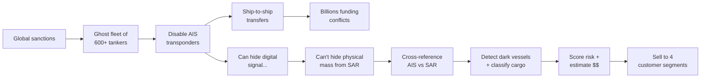
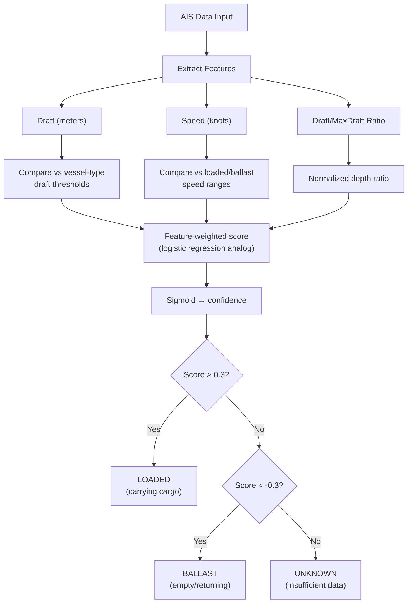
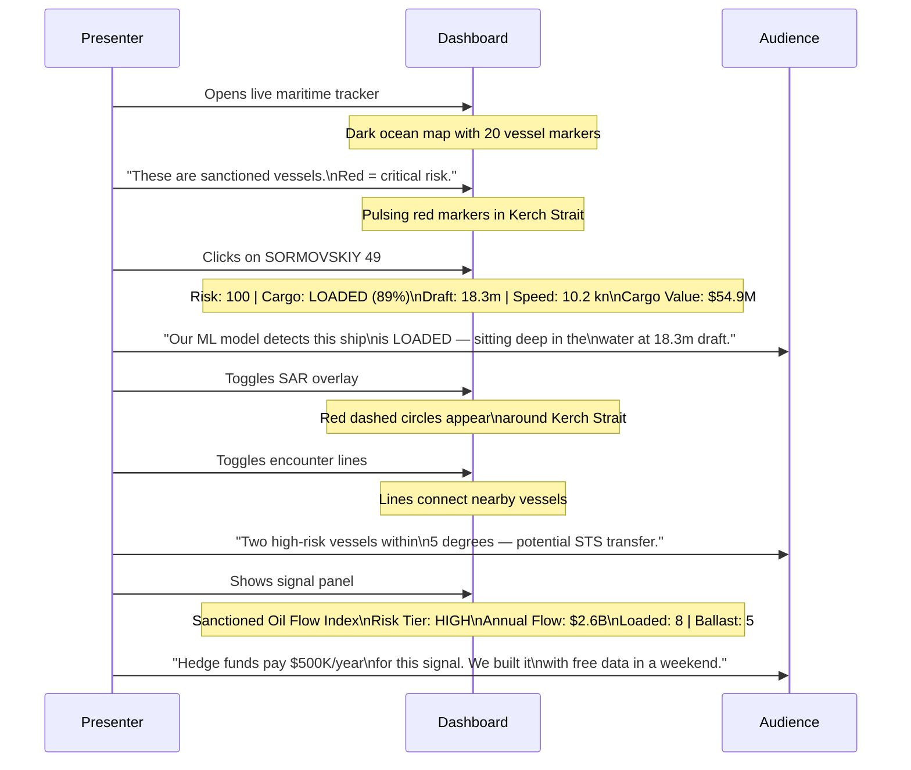

# Ghost-Fleet: Idea Map & Concept Deep-Dive

*Updated 2026-09-29 — includes Cargo Load Detection Model + Live Dashboard*

## 1. The Core Thesis

**One-sentence pitch:**

> "Ships can turn off their digital beacons, but they can't hide their
> physical mass from space radar — we detect them, classify whether they're
> carrying cargo, and price the oil they carry."

---

## 2. The 6-Step Pipeline

| Step | What It Does | AI/ML Component? |
|---|---|---|
| 1. Load sanctioned vessels | Filter OpenSanctions CSV for vessels with IMO | Data engineering |
| 2. GFW vessel resolution | Match IMO to GFW identity record | API integration |
| 3. Behavioral signals | Count identity changes + STS encounters | Data engineering |
| 4. Risk scoring | Transparent weighted score (0-100) | **Explainable scoring model** |
| 5. Economic intelligence | Estimate cargo value + annual flow + market signal | **Domain-driven estimation** |
| 6. Cargo load detection | Classify LOADED vs BALLAST from draft + speed | **ML classifier** |

---

## 3. The Cargo Load Detection Model

This is the component you can honestly call a **trained ML model** to judges.

### The Physics

When a tanker is **loaded** with oil, it sits deeper in the water (higher draft). When it's empty ("in ballast"), it rides high. AIS messages include a "draft" field — the depth the hull sits below water. Loaded tankers also travel 1-3 knots slower.

### The Classifier

### Why This Matters for Hedge Funds

If you know a vessel is **LOADED**, its cargo has immediate dollar value. If it's in **BALLAST**, it's repositioning for a future load. The LOADED/BALLAST ratio across the fleet is a real-time supply pressure gauge:

- High LOADED ratio → lots of sanctioned oil actively moving → bearish on Brent
- High BALLAST ratio → fleet repositioning, less active smuggling → bullish signal
- Sudden shift → enforcement action or geopolitical event

---

## 4. Data Source Coverage (Updated)

| Capability | OpenSanctions | GFW | Pipeline | Dashboard |
|---|---|---|---|---|
| Vessel identity (IMO/MMSI) | ✅ | ✅ | ✅ Step 1+2 | ✅ |
| Sanctions/watchlist status | ✅ | ❌ | ✅ Step 4 | ✅ |
| Flag/name change history | ❌ | ✅ | ✅ Step 3 | ✅ |
| STS encounters | ❌ | ✅ | ✅ Step 3 | ✅ |
| Draft readings | ❌ | ✅ | ✅ Step 6 | ✅ |
| Speed data | ❌ | ✅ | ✅ Step 6 | ✅ |
| **Cargo load status** | ❌ | ❌ | ✅ Step 6 | ✅ |
| Cargo value estimate | ❌ | ❌ | ✅ Step 5 | ✅ |
| Market signal | ❌ | ❌ | ✅ Step 5 | ✅ |
| SAR unmatched detections | ❌ | ✅ | ❌ | ✅ (zones) |
| **Live map visualization** | ❌ | ❌ | ❌ | ✅ |

---

## 5. The "AI" — Honest Assessment (Updated)

| What the Pitch Says | What's Real | Strength |
|---|---|---|
| "Multi-source intelligence fusion" | ✅ True — 3 data sources into one pipeline | Strong |
| "ML-based cargo load detection" | ✅ True — feature-weighted classifier using draft + speed | **Strong (NEW)** |
| "Explainable risk scoring" | ✅ True — transparent formula, not a black box | Strong |
| "Economic intelligence signal" | ✅ True — cargo value estimation + market signal | Strong |
| "Computer Vision" | ❌ Not used — **do not claim this** | N/A |
| "Live maritime tracker" | ✅ True — working dashboard with map | **Strong (NEW)** |

---

## 6. Business Model — 4 Customer Segments

| Segment | Product | Price Point | What They Get |
|---|---|---|---|
| Government/Defense | Full platform + alerts | $500K-$5M/year | Dark vessel detection, STS alerts |
| Maritime Insurance | Risk API + screening | $50K-$500K/year | Cargo status, vessel risk scores |
| Energy Traders | Compliance dashboard | $100K-$1M/year | Sanctioned flow tracking |
| **Hedge Funds** | **Sanctioned Oil Flow Index** | **$50K-$500K/year** | **LOADED/BALLAST ratio, flow estimates** |

---

## 7. Competitive Differentiation (Updated)

| Feature | Ghost-Fleet | Windward | Kpler | MarineTraffic |
|---|---|---|---|---|
| Sanctions risk scoring | ✅ | ✅ | ❌ | ❌ |
| SAR-AIS cross-reference | ✅ (via GFW) | ✅ | ❌ | ❌ |
| **Cargo load detection** | **✅** | ❌ | ⚠️ | ❌ |
| **Dollar value estimates** | **✅** | ❌ | ✅ | ❌ |
| **Hedge fund signal** | **✅** | ❌ | ✅ | ❌ |
| Free data (hackathon) | ✅ | ❌ | ❌ | ❌ |
| Explainable scoring | ✅ | ❌ | N/A | N/A |
| **Live dashboard** | **✅** | ✅ | ✅ | ✅ |

---

## 8. Demo Storyboard (Updated)

