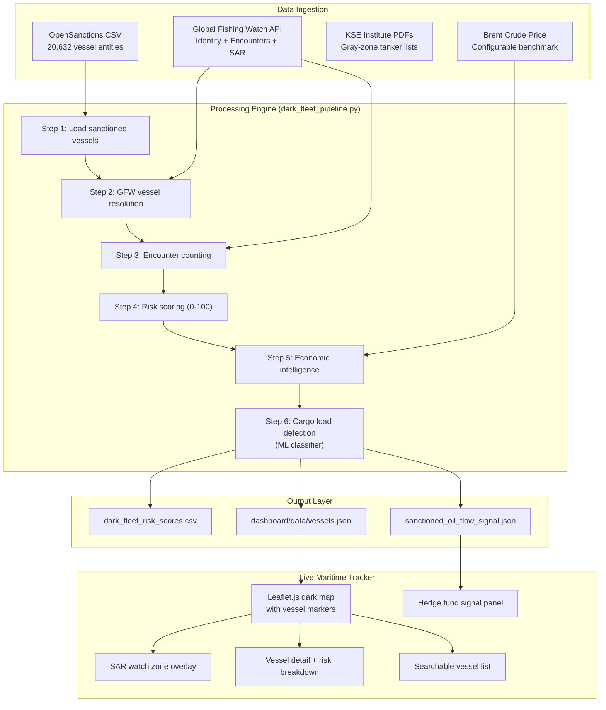
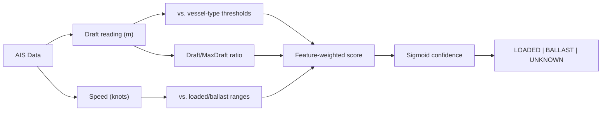

# Ghost-Fleet: Planning & Architecture Analysis

> **Historical / exploratory (superseded 2026-09-30).** This document predates
> the product brief. Scores, accuracy, and "built" claims here are unvalidated
> hackathon brainstorming. See `docs/PRODUCT_BRIEF.md` for current direction.

*Updated 2026-09-29 — v0.1.0 with Cargo Load Detection + Live Maritime Tracker*

## Executive Summary

Ghost-Fleet is a **maritime sanctions evasion detection system** with three
output layers:

1. **Risk Scoring** — per-vessel 0-100 score from multi-source intelligence fusion
2. **Cargo Load Detection** — ML-based classifier determining if vessels are carrying cargo or empty (LOADED/BALLAST)
3. **Sanctioned Oil Flow Index** — aggregate economic signal for hedge funds and commodity desks

The system now includes a **live maritime tracker dashboard** for real-time visual monitoring.

---

## 1. System Architecture



---

## 2. Component Status

| Component | Location | Status |
|---|---|---|
| OpenSanctions ingestion | `dark_fleet_pipeline.py` Step 1 | ✅ Built |
| GFW vessel resolution | `dark_fleet_pipeline.py` Step 2 | ✅ Built |
| Identity change detection | `dark_fleet_pipeline.py` Step 3 | ✅ Built |
| STS encounter counting | `dark_fleet_pipeline.py` Step 3 | ✅ Built |
| Risk scoring (0-100) | `dark_fleet_pipeline.py` Step 4 | ✅ Built |
| Cargo capacity estimation | `dark_fleet_pipeline.py` Step 5 | ✅ Built |
| Cargo value + annual flow | `dark_fleet_pipeline.py` Step 5 | ✅ Built |
| Market signal generator | `dark_fleet_pipeline.py` Step 5 | ✅ Built |
| **Cargo load classifier** | `dark_fleet_pipeline.py` Step 6 | ✅ **NEW** |
| **Live maritime tracker** | `dashboard/` | ✅ **NEW** |
| **Demo vessel data** | `dashboard/data/vessels.json` | ✅ **NEW** |
| GFW API token | env var | ❌ Needed for real data |
| OpenSanctions CSV | `maritime.csv` | ❌ Needed for real data |
| Pitch deck | — | ❌ Not built |

---

## 3. Cargo Load Detection Model (Step 6)

### How It Works

Ships sit deeper in the water when loaded with cargo (higher draft reading).
AIS messages include a draft field. We also use speed — loaded tankers are slower.



### Features and Weights

| Feature | Weight | Signal |
|---|---|---|
| Draft >= loaded threshold | +0.7 | Strong LOADED |
| Draft <= ballast threshold | -0.7 | Strong BALLAST |
| Draft/MaxDraft ratio > 0.75 | +0.4 | LOADED |
| Draft/MaxDraft ratio < 0.50 | -0.4 | BALLAST |
| Speed in 8-13 kn range | +0.2 | LOADED (slower) |
| Speed > 12 kn | -0.2 | BALLAST (faster) |

### Vessel Type Thresholds

| Vessel Type | Loaded Min (m) | Ballast Max (m) | Max Draft (m) |
|---|---|---|---|
| Crude Oil Tanker (VLCC) | 18.0 | 10.0 | 22.5 |
| Oil Tanker / Tanker | 14.0 | 8.0 | 17.0 |
| Oil/Chemical Tanker | 12.0 | 7.0 | 15.0 |
| Product Tanker | 10.0 | 6.0 | 13.0 |
| Chemical Tanker | 9.0 | 5.5 | 11.0 |
| LNG Tanker | 11.0 | 7.0 | 14.0 |

---

## 4. Live Maritime Tracker Dashboard

### Features

| Feature | Description |
|---|---|
| **Dark ocean map** | CARTO dark basemap via Leaflet.js |
| **Vessel markers** | Color-coded by risk (green/yellow/orange/red), pulsing for critical |
| **SAR watch zones** | Toggleable overlay showing known transshipment hotspots |
| **Encounter lines** | Toggleable lines between vessels in proximity |
| **Market signal panel** | Brent price, fleet count, loaded/ballast ratio, annual flow |
| **Vessel detail** | Click any vessel for risk breakdown, cargo status, economic estimate |
| **Risk breakdown bar** | Visual bar showing sanctions/identity/encounters contribution |
| **Searchable list** | Filter vessels by name or IMO, sorted by risk score |
| **Demo data included** | Works immediately with 20 pre-cached vessels |

### File Structure

```
dashboard/
├── index.html          # Main page
├── style.css           # Dark maritime theme
├── app.js              # Map + panels + interactions
└── data/
    └── vessels.json    # Pre-cached vessel data (20 vessels)
```

### How to Run

```powershell
# Option 1: Python HTTP server
cd dashboard
python -m http.server 8080

# Option 2: VS Code Live Server extension
# Right-click index.html → Open with Live Server
```

---

## 5. File Structure (Current)

```
nova-hackathon/
├── dark_fleet_pipeline.py          # ✅ Core pipeline (6 steps)
├── maritime.csv                    # ❌ Download from OpenSanctions
├── dark_fleet_risk_scores.csv      # Generated output
├── sanctioned_oil_flow_signal.json # Generated market signal
├── requirements.txt                # requests, pandas
├── README.md                       # Project overview
├── CHANGELOG.md                    # Version history
├── VERSION                         # 0.1.0
├── AGENTS.md                       # Collaboration rules
├── docs/
│   ├── HANDOVER.md                 # Current state snapshot
│   ├── SESSION_LOG.md              # Session history
│   ├── PLANNING.md                 # THIS FILE
│   ├── IDEA_MAP.md                 # Concept deep-dive
│   ├── JUDGE_REVIEW.md            # Vulnerability assessment
│   └── DATASETS_AND_ML_RESEARCH.md # Open datasets, ML models, benchmarks & latency
└── dashboard/                      # ✅ Live maritime tracker
    ├── index.html
    ├── style.css
    ├── app.js
    └── data/
        └── vessels.json            # 20 pre-cached demo vessels
```

---

## 6. Hackathon Execution Timeline (Updated)

| Phase | Hours | Tasks | Status |
|---|---|---|---|
| Foundation | 0-1 | Get GFW token, download CSV, run pipeline | ❌ |
| Dashboard | — | Build live tracker | ✅ **DONE** |
| Cargo Model | — | Build load detection classifier | ✅ **DONE** |
| Demo Story | 1-3 | Script narrative, find "wow" vessels | ❌ |
| Pitch | 3-5 | Create slides, practice presentation | ❌ |

**Remaining effort: ~5 hours** (down from 13, because dashboard and ML model are done)
