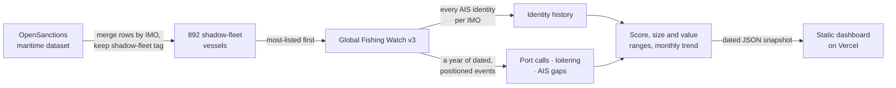

# 300-Vessel Snapshot, Plan-Gap Fixes, Licence and Showcase README: Implementation Plan

> **For agentic workers:** REQUIRED SUB-SKILL: Use superpowers:subagent-driven-development (recommended) or superpowers:executing-plans to implement this plan task-by-task. Steps use checkbox (`- [ ]`) syntax for tracking.

**Goal:** Ship the 300-vessel snapshot with the three missing dashboard items,
an MIT licence, a recorded demo GIF and a showcase README, with every quoted
figure regenerated from one script.

**Architecture:** The Python pipeline writes a trimmed JSON snapshot. A static
dashboard (`dashboard/`) reads it and is deployed to Vercel. A figures script
is the single source for every number quoted in docs and the deck. A
Playwright script records the live site, and ffmpeg converts the recording to
a GIF for the README.

**Tech stack:** Python 3.11, pandas, pytest, Playwright for Python 1.58
(Chromium installed), ffmpeg 8.1.2, Leaflet 1.9.4, Vercel CLI 54,
shields.io badges, Mermaid (rendered by GitHub).

**Spec:** `docs/superpowers/specs/2026-09-30-snapshot-300-readme-design.md`

## Global constraints

- Snapshot window: `--max 300 --start 2025-09-30 --end 2026-09-27`. Rebuild
  offline from `.cache/gfw/` and make no new API calls.
- `EVENTS_PER_VESSEL = 30`. `dashboard/data/vessels.json` must be 1.8 MB or less.
- The page layout stays unchanged: a full-height map, with the monitor and
  dossier in the right sidebar.
- GFW link format: `https://globalfishingwatch.org/map/vessel/<gfw_vessel_id>`.
- Licence: MIT, `Copyright (c) 2026 aaaditt`. It covers the code only. Data
  stays under OpenSanctions CC BY-NC 4.0 and Global Fishing Watch
  non-commercial terms.
- GIF: `docs/demo.gif`, 960px wide, 12 fps, 10–16 s, 8 MB or less. If it is
  too large, drop to 10 fps or 880px.
- Version **0.3.0**.
- Every data string inserted into HTML goes through `esc()`.
- Write in plain sentence case. Never state proof of wrongdoing.

## Review focus

1. **A vessel with `gfw_vessel_id: null`** (unmatched): the dossier must not
   render a broken GFW link. Task 2 covers this with a browser check on an
   unmatched vessel.
2. **A vessel with no position**: the list shows "No recent position", and
   opening it shows the dossier without moving or fading the map into an
   odd state. Task 2 covers this with a browser check.
3. **Stale figures**: any doc still quoting 120-vessel numbers (−15%, 115,
   63, 49, 92, 112) after the update. Task 3 ends with a grep that must come
   back empty.
4. **Browser cache after redeploy**: judges must see the new data. Task 4
   loads the page fresh with a cache-busting query string.
5. **A GIF too large for GitHub to show inline**: GitHub renders images up
   to 10 MB. Task 5 asserts 8 MB or less.

---

### Task 1: Trimmed 300-vessel snapshot with snapshot tests

**Files:**
- Modify: `dark_fleet_pipeline.py:62` (`EVENTS_PER_VESSEL`)
- Create: `tests/test_snapshot.py`
- Regenerate: `dashboard/data/vessels.json`, `dashboard/data/signal.json`

**Interfaces:**
- Produces: a committed snapshot in which each vessel has `events` (30 or
  fewer), `gfw_vessel_id` (a string or null), `_lat`/`_lng` (a float or
  null), `cargo_status`, and `identity_history`. `signal.json` has
  `vessels_screened`, `vessels_located`, `monthly`, `top_ports`.

- [ ] **Step 1: Write the failing test** in `tests/test_snapshot.py`

```python
"""Checks on the committed dashboard snapshot (what the live site serves)."""

import json
import math
import sys
from pathlib import Path

ROOT = Path(__file__).resolve().parents[1]
sys.path.insert(0, str(ROOT))
import dark_fleet_pipeline as p  # noqa: E402

VESSELS = ROOT / "dashboard" / "data" / "vessels.json"
SIGNAL = ROOT / "dashboard" / "data" / "signal.json"


def load(path):
    # parse_constant rejects NaN/Infinity, which browsers cannot parse
    def reject(name):
        raise ValueError(f"non-JSON constant {name} in {path.name}")
    return json.loads(path.read_text(encoding="utf-8"), parse_constant=reject)


def test_snapshot_is_valid_json_and_consistent():
    vessels = load(VESSELS)["vessels"]
    signal = load(SIGNAL)
    assert len(vessels) == signal["vessels_screened"]
    assert sum(v["_lat"] is not None for v in vessels) == signal["vessels_located"]


def test_events_are_trimmed_and_positions_numeric():
    for v in load(VESSELS)["vessels"]:
        assert len(v["events"]) <= p.EVENTS_PER_VESSEL
        if v["_lat"] is not None:
            assert isinstance(v["_lat"], float) and isinstance(v["_lng"], float)
            assert not math.isnan(v["_lat"])


def test_snapshot_stays_small_enough_for_phones():
    assert VESSELS.stat().st_size <= 1_800_000
```

- [ ] **Step 2: Run it and confirm the expected failures**

Run: `python -m pytest -q tests/test_snapshot.py`
Expected: FAIL on `test_snapshot_stays_small_enough_for_phones` (the file is
2.8 MB). The trim test also fails, because vessels hold up to 60 events.

- [ ] **Step 3: Trim to 30 events and rebuild offline**

In `dark_fleet_pipeline.py`, change line 62 to:

```python
EVENTS_PER_VESSEL = 30
```

Run: `python dark_fleet_pipeline.py --max 300 --offline --start 2025-09-30 --end 2026-09-27`
Expected last lines: `Matched 300/300, located 276, high-risk 234, 3-month activity trend -10.1%`

- [ ] **Step 4: Run all tests**

Run: `python -m pytest -q`
Expected: 12 passed (9 existing + 3 new). Also confirm the file size with
`ls -la dashboard/data/vessels.json` (1.8 MB or less).

- [ ] **Step 5: Commit**

```bash
git add dark_fleet_pipeline.py tests/test_snapshot.py dashboard/data/vessels.json dashboard/data/signal.json
git commit -m "feat(data): 300-vessel snapshot, trimmed to 30 events per vessel"
```

---

### Task 2: Dashboard plan-gap fixes (no-position tag, cargo figure, GFW link)

**Files:**
- Modify: `dashboard/index.html` (the `.figures` list)
- Modify: `dashboard/app.js` (`renderMonitor`, `renderList`, `openDossier`)
- Modify: `dashboard/style.css` (a `.v-nopos` tag style)

**Interfaces:**
- Consumes: the snapshot fields from Task 1.
- Produces: the element ids `fig-cargo` and `fig-cargo-note`, and the list
  tag class `v-nopos`.

- [ ] **Step 1: Add the cargo figure markup.** In `dashboard/index.html`,
  insert directly after the `Port calls, full months` `<div>`:

```html
                    <div>
                        <dt>Cargo state known</dt>
                        <dd id="fig-cargo">—</dd>
                        <p class="footnote" id="fig-cargo-note"></p>
                    </div>
```

- [ ] **Step 2: Fill the figure in `renderMonitor`.** In `dashboard/app.js`,
  after the line setting `$("fig-ports")`, add:

```js
    const known = vessels.filter((v) => v.cargo_status !== "UNKNOWN").length;
    $("fig-cargo").textContent = `${known} of ${vessels.length}`;
    $("fig-cargo-note").textContent = known
        ? "Estimated from draft readings where available."
        : "Public tracking data has no draft readings, so no vessel's load is inferred.";
```

- [ ] **Step 3: Tag vessels with no position in `renderList`.** Replace the
  `v-meta` span line with:

```js
            <span class="v-meta">IMO ${esc(v.imo)} · ${esc(flagName(v.current_flag))} · ${v.identity_changes} identity switches${v._lat == null ? ' · <span class="v-nopos">No recent position</span>' : ""}</span>
```

  Then add to `dashboard/style.css`, after the `.v-score.high` rule:

```css
.v-nopos { color: var(--magenta); }
```

- [ ] **Step 4: Add the GFW link in `openDossier`.** Replace the
  `$("d-sources").innerHTML = …` statement with:

```js
    const links = [];
    if (v.opensanctions_url) links.push(`<a href="${esc(v.opensanctions_url)}" target="_blank" rel="noopener">See the listings on OpenSanctions</a>`);
    if (v.gfw_vessel_id) links.push(`<a href="https://globalfishingwatch.org/map/vessel/${encodeURIComponent(v.gfw_vessel_id)}" target="_blank" rel="noopener">View on Global Fishing Watch</a>`);
    $("d-sources").innerHTML = `Named on ${programs} lists. ${links.join(". ")}${links.length ? "." : ""}`;
```

  Also, in `openDossier`, draw the map only for located vessels. Replace
  `drawTrack(v);` with:

```js
    if (v._lat != null) drawTrack(v); else clearTrack();
```

- [ ] **Step 5: Syntax check**

Run: `node --check dashboard/app.js`
Expected: no output (exit 0).

- [ ] **Step 6: Browser check (local)**

Start the server: `python -m http.server 8765` in `dashboard/` (run it in the
background). With Playwright at 1440×900, load `http://localhost:8765/?v=t2`
and evaluate:

```js
async () => {
  await new Promise(r => setTimeout(r, 2500));
  const data = await (await fetch('data/vessels.json')).json();
  const noPos = data.vessels.find(v => v._lat == null);
  const noGfw = data.vessels.find(v => !v.gfw_vessel_id);
  const tagged = [...document.querySelectorAll('#vessel-list .v-nopos')].length;
  location.hash = '';
  document.querySelector(`#vessel-list button[data-imo="${noPos.imo}"]`).click();
  const noPosDossier = !document.getElementById('view-dossier').hidden;
  document.getElementById('btn-back').click();
  document.querySelector('#vessel-list button[data-imo="9240885"]').click();
  const gfwHref = [...document.querySelectorAll('#d-sources a')].map(a => a.href);
  return { cargo: document.getElementById('fig-cargo').textContent, tagged, expectedTagged: data.vessels.filter(v => v._lat == null).length, noPosDossier, gfwHref, unmatchedExists: !!noGfw };
}
```

Expected:
- `cargo` is `"0 of 300"`.
- `tagged` equals `expectedTagged` (24).
- `noPosDossier` is `true`.
- `gfwHref` includes `https://globalfishingwatch.org/map/vessel/7ae24b256-68ba-fdb1-5698-b91778996e2f`.
- There are 0 console errors (`browser_console_messages` at level `warning`).

If `unmatchedExists` is true, open that vessel as well and confirm that
`#d-sources` has no GFW link.

- [ ] **Step 7: Commit**

```bash
git add dashboard/index.html dashboard/app.js dashboard/style.css
git commit -m "feat(dashboard): no-position tag, cargo-state figure, GFW vessel link"
```

---

### Task 3: One source for every figure, and the docs and deck updated from it

**Files:**
- Create: `scripts/figures.py` (copied from this session's scratchpad draft)
- Modify: `docs/submission/WRITEUP.md`, `docs/submission/DEMO_SCRIPT.md`,
  `docs/submission/PITCH.md`, `docs/PRODUCT_BRIEF.md` (only if it quotes
  figures)
- Modify: deck slides `answer`, `product` and `fleet` (the Slides artifact
  at `https://claude.ai/artifact/9SscVdcfFiNjFdTEaZLmeL`; files in the
  scratchpad `deck/project/slides/`)

**Interfaces:**
- Produces: `python scripts/figures.py` prints JSON with the keys
  `screened, matched, located, high_risk, trend_pct, recent_3m, prior_3m,
  trend_check_pct, monthly_active, switched_any, switched_5plus,
  median_switches, flags_used, landlocked_now, russia_now, median_lists,
  port_calls_full_months, top_ports, flow_bn, east1`.

- [ ] **Step 1: Add the script.** Copy
  `<scratchpad>/figures.py` to `scripts/figures.py` unchanged, then run
  `PYTHONIOENCODING=utf-8 python scripts/figures.py`.

  Expected output, which is the source of truth for the next steps:
  - screened 300, located 276, high_risk 234
  - trend −10.1 (595 vs 662)
  - monthly_active `[218,216,229,217,206,227,215,220,187,204,204,176]`
  - switched_any 289, switched_5plus 124, median_switches 4
  - flags_used 81
  - landlocked_now `{MLI:3, MWI:4, ZWE:3, BWA:1}` (11 in total)
  - russia_now 115, median_lists 7
  - port_calls_full_months 4547
  - top_ports: Nakhodka 475, Suez South Anchorage 433, Port Said 390, Primorsk 254, Ust Luga 226, De Kastri 121
  - flow_bn [64, 145]
  - east1 {score 75, ids 7}

- [ ] **Step 2: Update `WRITEUP.md`.** Apply these replacements:
  - "fell 15%" → "fell 10%"
  - "112 shadow-fleet tankers" → "276 shadow-fleet tankers"
  - The busiest-ports sentence becomes: "Nakhodka, Suez, Port Said, Primorsk
    and Ust-Luga, the export routes you would expect".
  - Snapshot table:
    - Screened: `300 (most-listed first; all 300 matched to tracking data)`
    - Switched: `289; median 4 switches, 124 switched 5+ times`
    - Flags: `81`
    - Landlocked: `11 (Malawi ×4, Mali ×3, Zimbabwe ×3, Botswana ×1)`
    - Russia: `115`
    - Trend: `−10%`
  - Challenges: "re-derived the figure (−15.3%)" → "re-derived the figure
    and checked it by hand". Remove the old number.
  - Limitations: "120 of 892" → "300 of 892".
  - Add a "Licence" line: "Code: MIT. Data: under its sources' terms."

- [ ] **Step 3: Update `DEMO_SCRIPT.md`.**
  - 0:20 line: "Across 300 of the most-sanctioned shadow-fleet tankers,
    activity fell 10% over the last three months."
  - Caption: `*−10% active sanctioned tankers, Jun–Aug vs Mar–May*`
  - 0:50 line: "Nakhodka in the Pacific, Primorsk and Ust-Luga on the Baltic,
    through Suez and Port Said."
  - Close: "Across these 300 ships we found 81 different flags, and eleven
    are flagged to landlocked countries today."

- [ ] **Step 4: Update `PITCH.md` rows 4 and 7.**
  - Row 4: `−10% | Active sanctioned tankers, Jun–Aug vs Mar–May (595 vs 662).`
  - Row 7: `289 of 300 switched identity; 81 flags; 11 landlocked; 115 now Russian.`

- [ ] **Step 5: Update the deck slides** in the scratchpad `deck/project/slides/`.

  `answer.html`:
  - The hero `−15%` becomes `−10%`.
  - The small line becomes "595 against 662 active-vessel months, across 300
    of the most-listed shadow-fleet ships."
  - The notes become 300 ships, −10%, 595 vs 662.
  - The SVG: 12 bars, height = round(400 × value / 229), y = 400 − height,
    x = 4 + 68 × i, keeping the same fills (indices 5–7 `#e6a9c4`, 8–10
    `#f5f8f8`, others `#c9658f`). Values:
    `218,216,229,217,206,227,215,220,187,204,204,176` → heights
    `381,377,400,379,360,397,376,384,327,356,356,307`.
  - The aria-label lists the new values.

  `product.html`:
  - "112 tankers" → "276 tankers".
  - Ports → "Nakhodka, Suez, Port Said, Primorsk, Ust-Luga."

  `fleet.html`:
  - Heading: "It isn't one ship. Across 300 of the most-listed tankers:"
  - Figures: 289 / 81 / 11 / 115.
  - Footer: "Median ship: 4 identity switches, named on 7 lists. Landlocked
    flags: Malawi 4, Mali 3, Zimbabwe 3, Botswana 1."
  - Notes: 289 of 300, 124 switched five or more times.

  Publish only the three changed files: the Artifact publish call with `url`
  = the deck, `root` = the scratchpad `deck` folder, `file_path` =
  `…/project/slides/answer.html`, and `files` = the product and fleet slides.

- [ ] **Step 6: Stale-figure grep (must be empty)**

Run: `git grep -nE "(−|-)15%|\b(112|115 of 120|63 different|63 flags|49 now|\\\$23)\b" -- README.md docs/submission docs/HANDOVER.md`
Expected: no matches. README and HANDOVER are rewritten in Tasks 6–7, so
matches there are allowed until then; rerun this grep at the end of Task 7.

- [ ] **Step 7: Commit**

```bash
git add scripts/figures.py docs/submission
git commit -m "docs: regenerate every quoted figure from the 300-vessel snapshot"
```

---

### Task 4: MIT licence, redeploy and live verification

**Files:**
- Create: `LICENSE`
- Regenerate: `docs/screenshot-overview.png`, `docs/screenshot-dossier.png`

- [ ] **Step 1: Write `LICENSE`**

```text
MIT License

Copyright (c) 2026 aaaditt

Permission is hereby granted, free of charge, to any person obtaining a copy
of this software and associated documentation files (the "Software"), to deal
in the Software without restriction, including without limitation the rights
to use, copy, modify, merge, publish, distribute, sublicense, and/or sell
copies of the Software, and to permit persons to whom the Software is
furnished to do so, subject to the following conditions:

The above copyright notice and this permission notice shall be included in all
copies or substantial portions of the Software.

THE SOFTWARE IS PROVIDED "AS IS", WITHOUT WARRANTY OF ANY KIND, EXPRESS OR
IMPLIED, INCLUDING BUT NOT LIMITED TO THE WARRANTIES OF MERCHANTABILITY,
FITNESS FOR A PARTICULAR PURPOSE AND NONINFRINGEMENT. IN NO EVENT SHALL THE
AUTHORS OR COPYRIGHT HOLDERS BE LIABLE FOR ANY CLAIM, DAMAGES OR OTHER
LIABILITY, WHETHER IN AN ACTION OF CONTRACT, TORT OR OTHERWISE, ARISING FROM,
OUT OF OR IN CONNECTION WITH THE SOFTWARE OR THE USE OR OTHER DEALINGS IN THE
SOFTWARE.
```

- [ ] **Step 2: Deploy**

Run: `vercel deploy --prod --yes --cwd dashboard`, then
`vercel ls ghost-fleet --cwd dashboard`.
Expected: the newest deployment shows `● Ready` in `Production`.

- [ ] **Step 3: Anonymous HTTP checks**

Run:

```bash
for p in / /data/signal.json /data/vessels.demo.json /.env.local; do echo "$p $(curl -s -o /dev/null -w '%{http_code}' https://ghost-fleet.vercel.app$p)"; done
curl -s https://ghost-fleet.vercel.app/data/signal.json | python -c "import json,sys;d=json.load(sys.stdin);print(d['vessels_screened'],d['activity_trend_3m_pct'])"
```

Expected: `200, 200, 404, 404`, then `300 -10.1`.

- [ ] **Step 4: Live browser checks and screenshots.** Use Playwright on
  `https://ghost-fleet.vercel.app/?v=030`.
  - At 1440×900: 0 console errors, the headline contains "fell 10%", and
    `#fig-cargo` reads "0 of 300". Take a screenshot to
    `docs/screenshot-overview.png`.
  - Open `https://ghost-fleet.vercel.app/?v=030#imo=9240885`: 7 identity rows
    and a GFW link present. Take a screenshot to
    `docs/screenshot-dossier.png`.
  - At 390×844: `document.documentElement.scrollWidth <= innerWidth`.

- [ ] **Step 5: Commit**

```bash
git add LICENSE docs/screenshot-overview.png docs/screenshot-dossier.png
git commit -m "chore: MIT licence; redeploy 300-vessel snapshot; refresh screenshots"
```

---

### Task 5: Recorded demo GIF

**Files:**
- Create: `scripts/record_demo.py`
- Create: `docs/demo.gif`

**Interfaces:**
- Produces: `python scripts/record_demo.py [--url URL]` writes
  `docs/demo.gif` and prints its size and duration.

- [ ] **Step 1: Write `scripts/record_demo.py`**

```python
"""Record the live Ghost Fleet demo path and convert it to docs/demo.gif.

Usage: python scripts/record_demo.py [--url https://ghost-fleet.vercel.app]
Needs: Playwright for Python with Chromium, and ffmpeg on PATH.
"""

import argparse
import shutil
import subprocess
import tempfile
from pathlib import Path

from playwright.sync_api import sync_playwright

ROOT = Path(__file__).resolve().parents[1]
OUT = ROOT / "docs" / "demo.gif"
SIZE = {"width": 1280, "height": 800}


def record(url: str, video_dir: Path) -> Path:
    with sync_playwright() as pw:
        browser = pw.chromium.launch()
        ctx = browser.new_context(viewport=SIZE, record_video_dir=str(video_dir), record_video_size=SIZE)
        page = ctx.new_page()
        page.goto(url + "?v=demo", wait_until="networkidle")
        page.wait_for_selector("#vessel-list button")
        page.wait_for_timeout(2500)                      # land on the map
        page.click("#vessel-search")
        page.keyboard.type("longevity", delay=120)       # search a former name
        page.wait_for_timeout(900)
        page.click('#vessel-list button[data-imo="9240885"]')
        page.wait_for_timeout(2500)                      # map zooms to WOLF's activity
        rail = page.locator("#rail")
        for _ in range(6):                               # read the identity list
            rail.evaluate("el => el.scrollBy({top: 110, behavior: 'smooth'})")
            page.wait_for_timeout(450)
        page.wait_for_timeout(1200)
        page.click("#btn-back")                          # back to the whole fleet
        page.wait_for_timeout(2200)
        video = page.video.path()
        ctx.close()
        browser.close()
    return Path(video)


def to_gif(src: Path, fps: int, width: int) -> None:
    palette = src.with_suffix(".png")
    flt = f"fps={fps},scale={width}:-1:flags=lanczos"
    subprocess.run(["ffmpeg", "-y", "-loglevel", "error", "-ss", "0.6", "-i", str(src),
                    "-vf", f"{flt},palettegen=stats_mode=diff", str(palette)], check=True)
    subprocess.run(["ffmpeg", "-y", "-loglevel", "error", "-ss", "0.6", "-i", str(src), "-i", str(palette),
                    "-lavfi", f"{flt}[x];[x][1:v]paletteuse=dither=bayer:bayer_scale=4:diff_mode=rectangle",
                    str(OUT)], check=True)


def main():
    parser = argparse.ArgumentParser()
    parser.add_argument("--url", default="https://ghost-fleet.vercel.app/")
    args = parser.parse_args()
    if not shutil.which("ffmpeg"):
        raise SystemExit("ffmpeg is not on PATH")
    with tempfile.TemporaryDirectory() as tmp:
        video = record(args.url.rstrip("/") + "/", Path(tmp))
        for fps, width in ((12, 960), (10, 960), (10, 880)):   # step down until it fits
            to_gif(video, fps, width)
            size = OUT.stat().st_size
            print(f"docs/demo.gif  {fps} fps  {width}px  {size / 1e6:.1f} MB")
            if size <= 8_000_000:
                break
        else:
            raise SystemExit("GIF is still over 8 MB; shorten the path or use the screenshot fallback")


if __name__ == "__main__":
    main()
```

- [ ] **Step 2: Run it**

Run: `python scripts/record_demo.py`
Expected: a line such as `docs/demo.gif  12 fps  960px  N.N MB`, with N.N at
8.0 or less.

- [ ] **Step 3: Check the GIF.** Get the duration with
  `ffprobe -v error -show_entries format=duration -of csv=p=0 docs/demo.gif`
  (expected 10–16 s). Then extract three frames with
  `ffmpeg -y -loglevel error -i docs/demo.gif -vf "select='eq(n\,5)+eq(n\,60)+eq(n\,120)'" -vsync 0 .playwright-mcp/frame_%d.png`
  and look at them. You should see the map on landing, the WOLF dossier, and
  the identity list.

  **Fallback** (only if the recording fails twice): take 5 Playwright
  screenshots of the same steps into `.playwright-mcp/step_1..5.png`, then
  run `ffmpeg -y -framerate 0.5 -i .playwright-mcp/step_%d.png -vf "scale=960:-1:flags=lanczos,split[a][b];[a]palettegen[p];[b][p]paletteuse" docs/demo.gif`.

- [ ] **Step 4: Commit**

```bash
git add scripts/record_demo.py docs/demo.gif
git commit -m "docs: recorded demo GIF of the live site"
```

---

### Task 6: Showcase README

**Files:**
- Modify (full rewrite): `README.md`

**Interfaces:**
- Consumes: `docs/demo.gif` (Task 5), the screenshots (Task 4), the figures
  (Task 3), `LICENSE` (Task 4), and the test count from `pytest -q` (12).

- [ ] **Step 1: Write `README.md`** with exactly this content (replace
  `{TESTS}` with the passing count from `python -m pytest -q`):

````markdown
<div align="center">

# Ghost Fleet

**Hidden oil supply, seen from the sea.**
A map-first monitor of the sanctioned shadow-fleet tankers, built for oil traders from public data.

[](https://ghost-fleet.vercel.app)


[](LICENSE)


**[Try it live](https://ghost-fleet.vercel.app)** · **[Open WOLF's dossier](https://ghost-fleet.vercel.app/#imo=9240885)**

</div>

---

> A ship can turn off its beacon, but it cannot stop leaving a trail.

Since 2022, a shadow fleet of ageing tankers has kept sanctioned Russian oil
moving by changing names, flags and radio identities. Ghost Fleet answers the
oil trader's question: **is that hidden supply rising or falling, and where is
it moving?**

## What the snapshot shows

| | 30 Sep 2025 – 27 Sep 2026 |
|---|---|
| Shadow-fleet tankers screened | **300**, all matched to tracking data; 276 with a recent position |
| Active tankers, last 3 months vs the 3 before | **−10%** (595 vs 662 vessel-months) |
| Switched identity at least once | **289** (124 switched five or more times) |
| Different flags used | **81** |
| Flagged today to a landlocked country | **11**: Malawi 4, Mali 3, Zimbabwe 3, Botswana 1 |
| Now flagged to Russia | **115** |
| Busiest ports of call | Nakhodka, Suez, Port Said, Primorsk, Ust-Luga |

## One hull, seven identities

IMO 9240885 is named on 10 sanctions and watch lists.
[Open its dossier →](https://ghost-fleet.vercel.app/#imo=9240885)

| # | Name | Flag | Years |
|---|---|---|---|
| 1 | Torm Gertrud | Denmark | 2012–14 |
| 2 | Torm Gertrud | Marshall Islands | 2014–16 |
| 3 | Torm Gertrud | Singapore | 2016–20 |
| 4 | East 1 | Hong Kong | 2020–25 |
| 5 | Longevity 7 | Palau | 2025–26 |
| 6 | Wolf | Malawi (landlocked) | Jun–Sep 2026 |
| 7 | **Wolf** | **Aruba** | since 7 Sep 2026 |

Its score of 75 is fully explained: 40 for the listings, 30 for identity
switches and 5 for loitering at sea. This summer it idled offshore for up to
14 days at a time.

## Features

- **Chart-style map.** Every located tanker at its latest observed position,
  with high-risk vessels in the magenta that nautical charts use for hazards.
- **Trend headline.** One plain sentence over 12 months of bars, showing
  exactly which months are compared.
- **Busiest ports.** The export routes appear straight out of the data.
- **Vessel dossier.** Score breakdown, every identity in order, recent dated
  activity plotted on the map, size and value ranges, and source links to
  OpenSanctions and Global Fishing Watch.
- **Search by former name.** Type a name a ship used years ago and find what
  it is called today.
- **Honest unknowns.** No draft data means cargo state is "unknown", not a
  guess. Values are ranges with their assumptions shown.

<p align="center">
  
  
</p>

## How it works



1. **Who is in the fleet.** The OpenSanctions export has one row per source
   list. Merging by IMO gives 892 shadow-fleet vessels, 772 of them formally
   sanctioned.
2. **What they did.** Global Fishing Watch often stores each re-flag as a
   separate record. We collect every identity carrying the IMO, then a year
   of port calls, loitering and AIS gaps across all of them.
3. **What it means.** An additive score, capacity ranges from gross
   tonnage, and a monthly activity series, written to a dated snapshot the
   dashboard reads.

## What we show, and what we don't claim

| We show | We don't claim |
|---|---|
| Which listed ships are active, and where | That any ship broke the law |
| Identity switches, from tracking records | Whether a tanker is loaded: free data has no draft |
| Value as an upper bound ($64–145 bn a year) | Barrels actually moved |
| Long idle periods at sea | That a ship-to-ship transfer happened |
| A dated one-year snapshot of 300 of 892 ships | A live feed |

## Run it yourself

Requirements: Python 3.10+, a free
[Global Fishing Watch API token](https://globalfishingwatch.org/our-apis/tokens),
and the [OpenSanctions maritime export](https://www.opensanctions.org/datasets/maritime/)
saved as `maritime.csv` in the repo root.

```powershell
python -m venv .venv; .\.venv\Scripts\Activate.ps1
python -m pip install -r requirements.txt
$env:GFW_API_TOKEN = "your-token"

python dark_fleet_pipeline.py --max 300 --start 2025-09-30 --end 2026-09-27
python dark_fleet_pipeline.py --max 300 --offline      # rebuild from the response cache
python -m pytest -q                                    # offline tests
python scripts/figures.py                              # every figure quoted in the docs

cd dashboard; python -m http.server 8765               # http://localhost:8765
vercel deploy --prod --cwd dashboard                   # deploy (static, no build)
python scripts/record_demo.py                          # re-record docs/demo.gif
```

The pipeline writes `dashboard/data/vessels.json` and `signal.json`. These
are committed deliberately, so the hosted demo needs no token. Raw API
responses are cached in `.cache/gfw/` (git-ignored).
`dashboard/data/vessels.demo.json` holds **fictional** vessels for offline
use and is never deployed.

## Project docs

- [Product brief](docs/PRODUCT_BRIEF.md): who it is for and the one question
  it answers.
- [Concept overview](docs/CONCEPT_OVERVIEW.md): the problem from first
  principles.
- Submission: [write-up](docs/submission/WRITEUP.md),
  [demo script](docs/submission/DEMO_SCRIPT.md),
  [pitch outline](docs/submission/PITCH.md).
- [Handover](docs/HANDOVER.md), [changelog](CHANGELOG.md),
  [session log](docs/SESSION_LOG.md), [collaboration rules](AGENTS.md).

## Data and licence

The code is released under the [MIT licence](LICENSE). The data keeps its
sources' terms:

- **OpenSanctions:** CC BY-NC 4.0; businesses need a data licence.
- **Global Fishing Watch:** non-commercial use, with attribution.
- **Basemap:** Esri, GEBCO, NOAA.

A commercial version would use licensed AIS data (with draft readings, to
tell loaded from empty) and a commercial sanctions-data licence.

A sanctions listing or a score is not proof of wrongdoing, and nothing here
is trading advice.
````

- [ ] **Step 2: Check the links locally.** Every relative path must exist:

Run: `python -c "import re,pathlib;s=open('README.md',encoding='utf-8').read();bad=[p for p in re.findall(r'\]\(((?!https?:)[^)#]+)\)|src=\"((?!https?:)[^\"]+)\"',s) for p in p if p and not pathlib.Path(p).exists()];print(bad or 'all links ok')"`
Expected: `all links ok`

- [ ] **Step 3: Rerun the stale-figure grep from Task 3, Step 6.**
  Expected: empty.

- [ ] **Step 4: Commit**

```bash
git add README.md
git commit -m "docs: showcase README with demo GIF, figures, story, diagram"
```

---

### Task 7: Close-out, version 0.3.0

**Files:**
- Modify: `VERSION`, `CHANGELOG.md`, `docs/SESSION_LOG.md`,
  `docs/HANDOVER.md`

- [ ] **Step 1: Set the version.** Write `0.3.0` to `VERSION`.
- [ ] **Step 2: Changelog.** Prepend `## [0.3.0] - 2026-09-30`:
  - **Added:** MIT licence; the 300-vessel snapshot; the "Cargo state known"
    figure; the no-position tag; the GFW vessel link; `scripts/figures.py`;
    `scripts/record_demo.py`; `docs/demo.gif`; the showcase README; the
    snapshot tests.
  - **Changed:** 30 events kept per vessel; figures across all docs and the
    deck regenerated (trend −10%).
- [ ] **Step 3: Session log.** Append an entry with the objective, the
  decisions (MIT; 300 vessels; 30-event trim; GIF approach A or the
  fallback, whichever was used), the changed files, and the validation (the
  pytest count, HTTP checks, the browser checks, GIF size and duration).
  List what remains: the video recording, team names on the deck, sharing
  the deck, submitting.
- [ ] **Step 4: Handover.** Rewrite `docs/HANDOVER.md` with the 300-vessel
  figures, version 0.3.0, the licence, the GIF script, and the same risks
  updated to 300 of 892 vessels.
- [ ] **Step 5: Final validation**

Run:
- `python -m pytest -q` (all pass)
- `git grep -nE "(−|-)15%|115 of 120|63 different" -- README.md docs/submission docs/HANDOVER.md` (empty)
- the secret scan:
  `grep -rEl "eyJ[A-Za-z0-9_-]{30}|ghp_|github_pat_" --exclude-dir=.git --exclude-dir=.cache --exclude-dir=.venv --exclude=.env.local .`
  (empty)

- [ ] **Step 6: Commit and push**

```bash
git add VERSION CHANGELOG.md docs/SESSION_LOG.md docs/HANDOVER.md
git commit -m "chore: release 0.3.0"
git push origin main
```

- [ ] **Step 7: Check the README on GitHub.** Open
  `https://github.com/aaaditt/ghost-fleet` in Playwright. Confirm that the GIF
  and both screenshots load (`naturalWidth > 0`), the Mermaid block renders
  as a diagram, and all 5 badges load.
